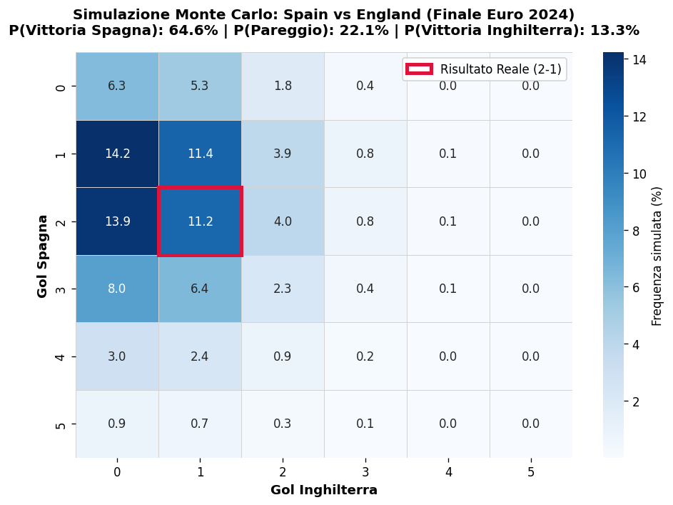

# ⚽ Football Event Data Analytics & Match Modeling

Analisi quantitativa, tattica e probabilistica sui dati evento ufficiali **StatsBomb**, articolata in moduli verticali che combinano spatial analytics avanzata e simulazioni stocastiche per la match analysis.

---

## 📂 Struttura del Repository

* **[Modulo 1: Spatial Event Analytics & Tactical Report (World Cup 2022 Final)](#-modulo-1-world-cup-2022-final--tactical-match-report--spatial-event-analytics)**
* **[Modulo 2: Shot-by-Shot Monte Carlo Match Simulator (Euro 2024 Final)](#-modulo-2-uefa-euro-2024-final--shot-by-shot-monte-carlo-simulation)**

---

## 🏆 Modulo 1: World Cup 2022 Final — Tactical Match Report & Spatial Event Analytics

> Analisi tattica quantitativa e spaziale condotta sugli open data di evento ufficiali **StatsBomb** della finale dei Mondiali 2022 (**Argentina vs Francia**), integrando modelli di pericolosità offensiva (xG/xG per tiro), reti di trasmissione (Passing Networks) e mappe di densità difensiva (KDE Heatmaps).

### 🎯 Obiettivi della Match Analysis
* **Expected Goals (SxG) & Shot Quality:** Mappatura bidimensionale e quantificazione della qualità delle conclusioni tentate nel corso dei 120 minuti.
* **Passing Network & Structural Balance:** Baricentro medio dei titolari dell'Argentina e densità dei canali di trasmissione palla prima dei cambi tattici.
* **Defensive Intensity & Spatial Control:** Distribuzione spaziale delle azioni difensive (pressing, contrasti, intercetti, blocchi) per evidenziare le altezze di riconquista palla.

### 📊 Visualizzazioni e Analisi Tattica

#### 1. Shot Map & Expected Goals (SxG)

* **Argentina (2.76 xG):** Volume superiore di conclusioni nel cuore dell'area di rigore e costanza di minaccia costruita con attacchi manovrati centrali.
* **Francia (2.27 xG):** Pericolosità concentrata nella ripresa e nei supplementari, trainata da transizioni dirette a campo aperto ed episodi ad alta conversione.

#### 2. Argentina Starting XI Passing Network (0' - 63')

* **Costruzione Bassa:** Connessione primaria Romero-Otamendi con Martinez a fungere da perno basso.
* **Nucleo Mediano:** Triangolo Fernández-De Paul-Mac Allister a dettare i ritmi della manovra e schermare le seconde palle.
* **Sviluppo Offensivo:** Asimmetria con Di María isolato in ampiezza pura a sinistra e Messi libero di ricevere e rifinire sul mezzo-spazio destro.

#### 3. Defensive Activity & Pressing Density Map

* **Argentina (311 azioni):** Baricentro medio-alto, con densità di pressione estesa alla trequarti rivale per bloccare la prima costruzione avversaria.
* **Francia (319 azioni):** Baricentro basso, concentrazione difensiva a protezione degli ultimi 30 metri e linee di recupero posizionate per la transizione immediata.

---
---

## 🎲 Modulo 2: UEFA Euro 2024 Final — Shot-by-Shot Monte Carlo Simulation

> Modellazione stocastica e simulazione probabilistica della finale di **UEFA Euro 2024 (Spagna vs Inghilterra)** tramite **100.000 iterazioni Monte Carlo vettorizzate**, basate sui micro-dati dei singoli tiri registrati da StatsBomb.

### 📌 Business & Analytical Insights
Nel calcio il punteggio effettivo (2-1) è spesso influenzato dall'alta varianza stocastica connaturata a uno sport a basso punteggio. Questa simulazione disaccoppia la casualità dalla prestazione strutturale:

* **Dominio Territoriale e Qualità:** La Spagna ha registrato **1.79 xG** (16 tiri) contro **0.73 xG** (9 tiri) dell'Inghilterra.
* **Distribuzione degli Esiti nei 90 minuti:**
  * **P(Vittoria Spagna):** 64.6%
  * **P(Pareggio):** 22.1%
  * **P(Vittoria Inghilterra):** 13.3%
* **Expected Points (xPTS):** Spagna **2.16** | Inghilterra **0.62**
* **Verifica del Risultato Reale (2-1):** Verificatosi con una densità dell'**11.2%**, risultando uno degli esiti a maggior frequenza relativa (dopo 1-0 al 14.2%, 2-0 al 13.9% e 1-1 all'11.4%).

### 📊 Matrice di Probabilità dei Risultati Esatti

### 🔬 Metodologia Statistica
Ogni conclusione *i* con valore xG compreso tra 0 e 1 viene modellata come una variabile casuale bernoulliana indipendente:

* **P(Gol) = xG**
* Per ciascuna delle 100.000 iterazioni viene estratto un valore casuale uniforme `U ~ Uniform(0, 1)`. L'evento gol si verifica se `U < xG`.
* Il calcolo degli Expected Points (**xPTS**) deriva direttamente dalle frequenze relative stimate:
  * `xPTS = (3 × P(Win)) + (1 × P(Draw))`

---
