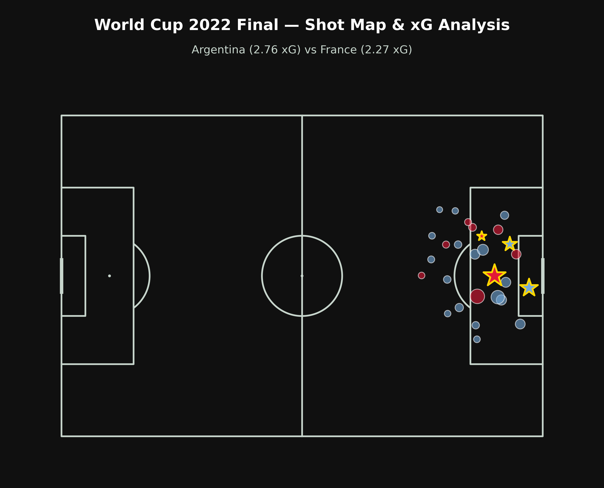
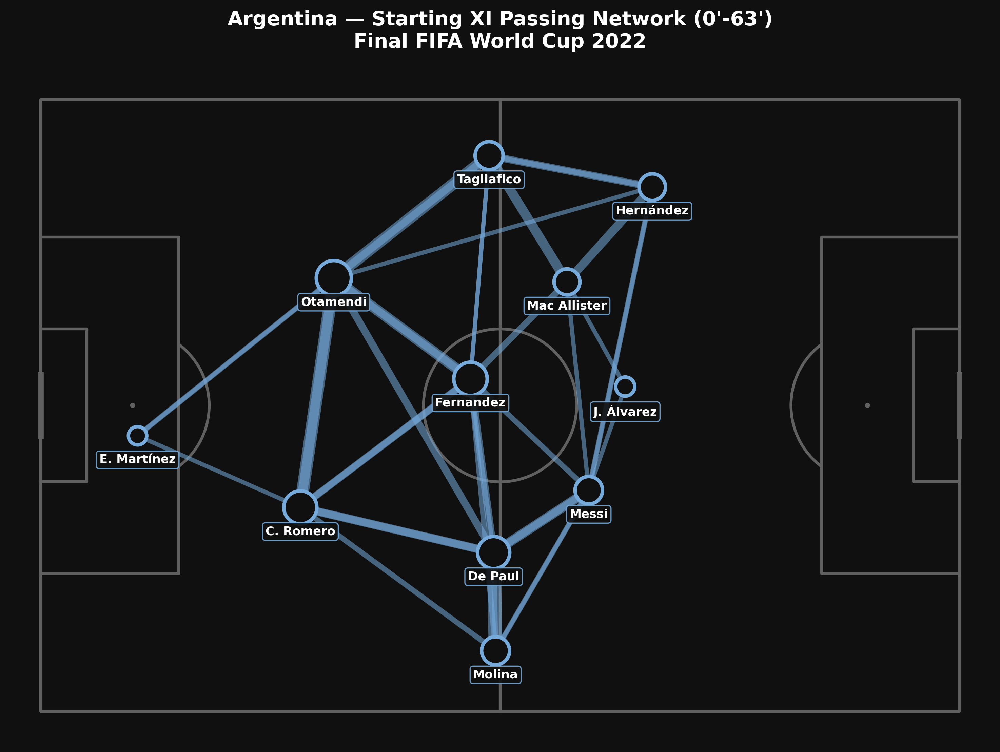
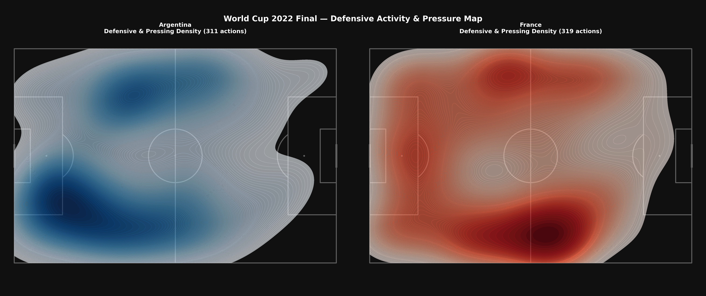

# ⚽ World Cup 2022 Final — Tactical Match Report & Spatial Event Analytics

Analisi tattica quantitativa e spaziale condotta sugli open data di evento ufficiali **StatsBomb** della finale di World Cup 2022 (**Argentina vs Francia**), integrando modelli di pericolosità offensiva ($xG$), reti di trasmissione (Passing Networks) e mappe di densità difensiva (KDE Heatmaps).

---

## 📌 Obiettivi della Match Analysis

* **Expected Goals ($xG$) Shot Quality:** Mappatura bidimensionale e quantificazione della qualità delle conclusioni tentate nel corso dei 120 minuti.
* **Passing Network & Structural Balance:** Baricentro medio dei titolari dell'Argentina e densità dei canali di trasmissione palla prima dei cambi tattici.
* **Defensive Intensity & Spatial Control:** Distribuzione spaziale delle azioni difensive (pressing, contrasti, intercetti, blocchi) per evidenziare le altezze di riconquista palla.

---

## 🛠️ Stack Tecnologico & Librerie

* **Linguaggio:** Python
* **Ambiente:** Google Colab / JupyterLab
* **Librerie Principali:**
  * `statsbombpy`: estrazione e parsing degli event data ufficiali.
  * `mplsoccer`: rendering vettoriale dei campi da calcio, matrici di passaggio e mappe KDE.
  * `pandas` & `numpy`: vettorizzazione delle coordinate $(x, y)$, filtri ed elaborazioni aggregate.
  * `matplotlib`: layout grafico e visual design in alta risoluzione.

---

## 📊 Visualizzazioni & Analisi Tattica

### 1. Shot Map & Expected Goals ($xG$)
La dimensione dei cerchi è proporzionale all'xG generato dal singolo tiro; le conclusioni convertite in gol sono evidenziate da marcatori a stella.

* **Argentina (2.76 xG):** Volume superiore di conclusioni nel cuore dell'area di rigore e costanza di minaccia costruita con attacchi manovrati centrali.
* **Francia (2.27 xG):** Pericolosità concentrata nella ripresa e nei supplementari, trainata da transizioni dirette a campo aperto ed episodi ad alta conversione.

---

### 2. Argentina Starting XI Passing Network (0' - 63')
Rete dei passaggi tracciata sull'undici titolare prima della prima sostituzione (uscita di Di María al 64'). La dimensione dei nodi riflette il volume di passaggi eseguiti; lo spessore delle linee indica il volume degli scambi tra compagni (minimo 4 passaggi).

* **Costruzione Bassa:** Connessione primaria Romero–Otamendi con Martínez a fungere da perno basso.
* **Nucleo Mediano:** Triangolo Fernández–De Paul–Mac Allister a dettare i ritmi della manovra e schermare le seconde palle.
* **Sviluppo Offensivo:** Asimmetria con Di María isolato in ampiezza pura a sinistra e Messi libero di ricevere e rifinire sul mezzo-spazio destro.

---

### 3. Defensive Activity & Pressing Density Map
Stima di densità bivariata (Kernel Density Estimation) applicata sull'intero volume delle azioni difensive (pressioni, contrasti, intercetti, falli commessi, spazzate e blocchi).

* **Argentina (311 azioni):** Baricentro medio-alto, con densità di pressione estesa alla trequarti rivale per bloccare la prima costruzione avversaria.
* **Francia (319 azioni):** Baricentro basso, concentrazione difensiva a protezione degli ultimi 30 metri e linee di recupero posizionate per la transizione immediata.

---

## 💡 Valore Metodologico

L'integrazione di coordinate spaziali ed event metrics consente a match analyst e staff tecnico di superare i limiti della statistica descrittiva pura (es. possesso palla o tiri totali), oggettivando la reale occupazione degli spazi, l'efficacia del pressing e la pericolosità qualitativa delle scelte tattiche.
